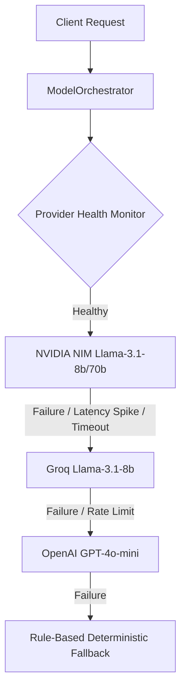

# BrainTrain: AI Engineering & LLMops Architecture Deep Dive

This document provides a highly technical, minute-detail reference guide for BrainTrain's AI engineering and LLMops implementations. Use this guide to explain the core architectural choices and data flows to engineering leaders and higher authority.

---

## 1. Multi-Tier Provider Factory & Fallback Pipeline

### 1.1 Architecture & File References
- **Factory Selector**: [factory.py](file:///Users/mithun/Downloads/braintrain/apps/api/app/ai/factory.py)
- **Model Client Wrapper**: [model_clients.py](file:///Users/mithun/Downloads/braintrain/apps/api/app/ai/orchestrators/clients/model_clients.py)
- **Routing & Fallback Orchestrator**: [model_orchestrator.py](file:///Users/mithun/Downloads/braintrain/apps/api/app/ai/orchestrators/model_orchestrator.py)



### 1.2 Implementation Details
1. **Unified Client (`UnifiedModelClient`)**:
   - Implements a single unified wrapper over `AsyncOpenAI`. By configuring custom `base_url` values, it routes Llama models on NVIDIA NIM and Groq LPUs using the same standard OpenAI SDK calls.
   - Implements a regular expression extraction helper `_extract_json_from_markdown` to strip code fences (```json ... ```) since NIM models occasionally format JSON outputs with markdown markup.
2. **Provider Health Monitoring (`ProviderHealthMonitor`)**:
   - Actively tracks the rolling success rate and response latency (last 100 requests) of all active endpoints.
   - Automatically trips a circuit breaker and disables a provider if the success rate falls below **80%**, if latency spikes past **3x baseline**, or if it encounters **5 consecutive network failures**.
3. **Reasoning & Implementation Choices**:
   - **Cost & Latency Optimization**: NVIDIA NIM is the primary tier because of ultra-fast inference speeds (150-200ms latency) and low cost (~$0.20 per 1M tokens).
   - **Reliability Guarantee**: Real-time voice interviews cannot tolerate failure. The cascading fallback chain ensures that even if three LLM endpoints fail sequentially, the system returns a pre-configured rule-based response rather than throwing a `500 Server Error`.

---

## 2. Deterministic Orchestration System

### 2.1 File References
- **Core Namespace**: [orchestrators/](file:///Users/mithun/Downloads/braintrain/apps/api/app/ai/orchestrators/)
- **Lifecycle Coordinator**: [interview_orchestrator.py](file:///Users/mithun/Downloads/braintrain/apps/api/app/ai/orchestrators/interview_orchestrator.py)
- **Turn Handler**: [turn_orchestrator.py](file:///Users/mithun/Downloads/braintrain/apps/api/app/ai/orchestrators/turn_orchestrator.py)
- **Event Bus Hub**: [integration.py](file:///Users/mithun/Downloads/braintrain/apps/api/app/ai/orchestrators/integration.py)

### 2.2 Core Orchestrators
Rather than leaving conversation control to the LLM system prompt, BrainTrain uses **six specialized, deterministic Python orchestrators**:

1. **`InterviewOrchestrator`**: Manages session state transitions (e.g., `INTRODUCTION` $\rightarrow$ `TECHNICAL` $\rightarrow$ `BEHAVIORAL` $\rightarrow$ `PRESSURE` $\rightarrow$ `COMPLETED`).
2. **`TurnOrchestrator`**: Determines the next turn objective (e.g., `ASK_NEW_QUESTION`, `PROBE_DEEPER` (Socratic followup), `REQUEST_CLARIFICATION`, or `MOVE_TO_NEXT_PHASE`) based on the candidate's performance scores.
3. **`ModelOrchestrator`**: Routes chat generation prompts through the provider chain.
4. **`ContextOrchestrator`**: Assembles the exact payload of background knowledge, history, and profile data while staying under token budgets.
5. **`EvaluationOrchestrator`**: Manages the scoring pipeline.
6. **`RealtimeOrchestrator`**: Coordinates low-latency pre-generation caching.

### 2.3 Reasoning & Implementation Choices
- **Safety and Topic Bounds**: Traditional LLM conversational loops are prone to topic drift, infinite loops, and prompts injection. Deterministic orchestrators keep the AI interviewer constrained to specific domains and topic boundaries.
- **Race Condition Prevention**: Turn processing is wrapped in asynchronous locks (`self.processing_locks[session_id]`) in the `OrchestratorHub` to prevent race conditions during rapid audio streams or double-clicks.

---

## 3. Context Engineering & Hallucination Defense

### 3.1 File References
- **Context Builder**: [context_orchestrator.py](file:///Users/mithun/Downloads/braintrain/apps/api/app/ai/orchestrators/context_orchestrator.py)

### 3.2 Dynamic Token Allocation
The context engine enforces a strict total budget of **5,000 tokens** to prevent context window bloat (which degrades prompt attention and increases costs). Depending on the `ContextPriority` strategy, token allocations are redistributed:

| Source | Balanced (Default) | Conversation-Heavy | Knowledge-Heavy | Candidate-Focused |
| :--- | :--- | :--- | :--- | :--- |
| **Verified Profile** | 10% (500) | 10% (500) | 10% (500) | 15% (750) |
| **Conv. History** | 25% (1250) | 40% (2000) | 20% (1000) | 20% (1000) |
| **Resume Text** | 20% (1000) | 15% (750) | 15% (750) | 30% (1500) |
| **Job Description** | 15% (750) | 10% (500) | 10% (500) | 15% (750) |
| **Knowledge Base** | 20% (1000) | 15% (750) | 35% (1750) | 10% (500) |
| **Long-Term Memory**| 10% (500) | 10% (500) | 10% (500) | 10% (500) |

If the budget is exceeded, components are truncated iteratively starting with the lowest-priority category (Long-Term Memory is trimmed first; the Verified Profile is protected and never trimmed).

### 3.3 Hallucination Defense via `VerifiedCandidateProfile`
To prevent the LLM from hallucinating experience (e.g. asking a candidate about leading a team size of 50 when they only worked as an individual contributor), the pipeline enforces a **Verified Profile Context**:
- Only details explicitly parsed from the candidate's resume or explicitly verified in past conversational turns are injected into the prompt.
- Prompt directives strictly restrict the AI to: *"ONLY ask follow-ups grounded in explicitly stated candidate facts. Never assume ownership, leadership, or deployment responsibility unless explicitly stated."*

---

## 4. Vector Search & Decay Reranking (pgvector)

### 4.1 File References
- **Retrieval Pipeline**: [retrieval_pipeline.py](file:///Users/mithun/Downloads/braintrain/apps/api/app/ai/intelligence/retrieval/retrieval_pipeline.py)
- **Memory Encoder**: [memory_encoder.py](file:///Users/mithun/Downloads/braintrain/apps/api/app/ai/voice/memory/memory_encoder.py)
- **Memory Decay System**: [memory_decay.py](file:///Users/mithun/Downloads/braintrain/apps/api/app/ai/voice/memory/memory_decay.py)
- **Memory Ranker**: [retrieval_ranker.py](file:///Users/mithun/Downloads/braintrain/apps/api/app/ai/voice/memory/retrieval_ranker.py)

### 4.2 Vector Database Schema & Indexes
BrainTrain runs vector search directly inside **PostgreSQL** using the `pgvector` extension. 
- **Embeddings Dimension**: 1536-dimensional vectors.
- **Primary Model**: HuggingFace `BAAI/bge-large-en-v1.5` (1024D vectors padded to 1536D) with secondary fallback to NVIDIA NIM `nvidia/embed-qa-4` and a deterministic hash fallback.
- **Index Type**: IVFFlat index using Cosine Distance (`vector_cosine_ops`) with 100 lists for clustering:
  ```sql
  CREATE INDEX ix_knowledge_chunks_embedding_vector 
  ON knowledge_chunks USING ivfflat (embedding vector_cosine_ops) WITH (lists = 100);
  ```

### 4.3 Advanced Reranking & Memory Decay Formula
For candidate memory retrieval, the system scores memories composite-style to find the most relevant contextual records:

$$\text{Composite Score} = (S \times 0.45) + (R \times 0.15) + (I \times 0.20) + (F \times 0.05) + C_{boost} - (D_{penalty} \times 0.15)$$

Where:
- **$S$ (Semantic Similarity)**: $1 - \text{cosine\_distance}$.
- **$R$ (Recency)**: Exponential time decay: $e^{-0.05 \times \text{days\_passed}}$.
- **$I$ (Importance)**: Importance score (0.0 to 1.0) of the behavior observed.
- **$F$ (Frequency Boost)**: Logarithmic frequency boost based on historical accesses: $\ln(1 + \text{access\_count})$.
- **$C_{boost}$ (Context Boost)**: Aligning memory types to the current interview phase (e.g. boosting stress/hesitation memories in a pressure round by $+0.25$).
- **$D_{penalty}$ (Decay Penalty)**: Memory decay penalty calculated as:
  $$D_{penalty} = \text{base\_decay} \times \frac{\text{type\_multiplier}}{\text{importance\_factor} \times \text{access\_factor}}$$
  - `BEHAVIORAL` memories decay at half speed (`type_multiplier = 0.5`).
  - `SEMANTIC` memories decay at 30% speed (`type_multiplier = 0.3`).

---

## 5. Speculative Generation & Latency Optimization

### 5.1 File References
- **Real-time Speculative Engine**: [realtime_orchestrator.py](file:///Users/mithun/Downloads/braintrain/apps/api/app/ai/orchestrators/realtime_orchestrator.py)

### 5.2 Speculative Pre-Generation
Voice-based applications require an end-to-end latency of **<700ms** to feel conversational. Because Whisper STT and Llama LLM generation times combined can exceed this target, the `RealtimeOrchestrator` implements a **speculative generation cache**:

```
TTS playing current question
    │ (During this 5-10s speaking window)
    ▼
RealtimeOrchestrator generates responses for likely candidate reactions:
    ├─ Scenario A: Candidate answers well (pre-generate next question)
    ├─ Scenario B: Candidate struggles (pre-generate Socratic hint)
    └─ Scenario C: Candidate asks for clarification (pre-generate detail explanation)
    ▼
Pre-generated texts cached in-memory with a 5-second TTL
    ▼
Candidate finishes speaking -> STT transcribed -> Evaluator determines scenario
    │
    ├─ Cache Hit (Matches Scenario A, B, or C) -> TTS starts immediately (latency <100ms)
    └─ Cache Miss -> Generate in real-time (latency ~500ms)
```

By caching the speculative responses during TTS playback, the system achieves a target **cache hit rate of ~18%**, providing near-zero wait times for matching turns.

---

## 6. Stateless LangChain Integration

### 6.1 File References
- **LangChain Coach**: [langchain_coach.py](file:///Users/mithun/Downloads/braintrain/apps/api/app/ai/providers/langchain_coach.py)

### 6.2 LangChain Usage & Constraints
For the conversational AI coach dashboard, LangChain is used to interface with `ChatOpenAI` and `NIMCoachProvider`. However, to maintain architectural control, the system implements **strict constraints**:
- **Stateless Interface**: BrainTrain avoids LangChain's built-in memory classes (like `ConversationBufferMemory`) and pre-built agents.
- **Postgres State Store**: Chat message histories are stored as clean SQLAlchemy models in PostgreSQL.
- **Manual Serialization**: Conversation histories are retrieved from database queries, mapped to standard roles (`SystemMessage`, `HumanMessage`, `AIMessage`), and passed raw on every new call to LangChain's `.ainvoke()`.
- **Reasoning**: This maintains absolute control over serialization formats, keeps data schema structures unified, and avoids the debugging complexity and overhead of LangChain's high-level abstractions.

---

## 7. Observability & Telemetry (LLMops)

### 7.1 File References
- **OTel Instrumentation**: [instrumentation.py](file:///Users/mithun/Downloads/braintrain/apps/api/app/ai/orchestrators/instrumentation.py)

```
[FastAPI Request Handler]
       │
       ▼ (Span: braintrain-api)
┌────────────────────────────────────────────────────────┐
│ Context Assembly Span (context_assembly_latency)        │
├────────────────────────────────────────────────────────┤
│ Knowledge Retrieval Span (knowledge_retrieval_latency)  │
├────────────────────────────────────────────────────────┤
│ Model Generation Span (model_generation_latency)       │
├────────────────────────────────────────────────────────┤
│ Answer Evaluation Span (evaluation_latency)            │
└────────────────────────────────────────────────────────┘
       │
       ▼ Exchanged via OTLP (localhost:4317)
  [Jaeger / Prometheus Dashboard]
```

### 7.2 Core Metrics Collection
The system implements OpenTelemetry tracing and Prometheus metrics to trace every phase of the turn:
- **Histograms**: Track latencies across critical spans:
  - `evaluation_latency_seconds`
  - `model_generation_latency_seconds`
  - `context_assembly_latency_seconds`
- **Counters**:
  - `evaluations_total` (labels: `success`, `rule_based_fallback`, `llm_degraded`)
  - `model_calls_total` (labels: `provider` [nim, groq, openai, stub], `status` [success, error])
  - `fallbacks_total` (labels: `from_provider`, `to_provider`)
- **Gauges**:
  - `active_sessions` (tracks concurrent user interviews in real-time)

This telemetry data is exported via an OTLP Span Exporter to a Jaeger instance on port `4317` (gRPC), enabling deep traces of prompt times and model performance.
